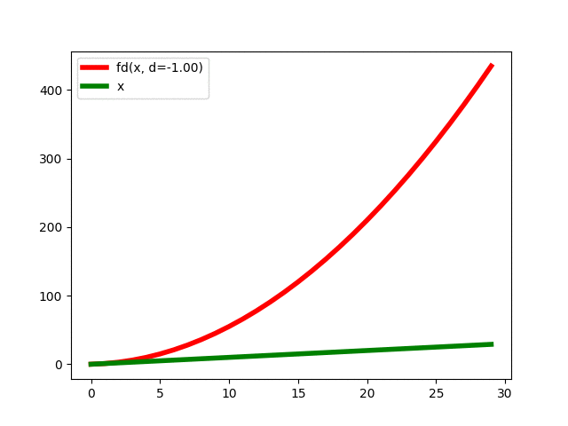

## Fractional Differentiation on Time Series (original impl)

*As described in Advances of Machine Learning by Marcos Prado.*

### Installation

Via PyPI

```commandline
pip install fracdiff2
```

### API

```python
from fracdiff2 import frac_diff_ffd
import numpy as np

x = np.random.uniform(size=(1000,))
frac_diff_ffd(x, d=0.5)
```

### SP500 returns with frac returns

This example reproduces the visual seen in the book of Marcos Prado.

<p align="center">
  
</p>

### F(x) = x and its derivatives/anti-derivatives

The animation shows the derivative operator oscillating between the antiderivative (α=−1: y = ​1⁄2⋅x2) and the
derivative (α = +1: y = 1) of the simple function y = x continuously.

<p align="center">
  
</p>


### References

- https://www.wiley.com/en-us/Advances+in+Financial+Machine+Learning-p-9781119482086
- https://wwwf.imperial.ac.uk/~ejm/M3S8/Problems/hosking81.pdf
- https://en.wikipedia.org/wiki/Fractional_calculus
