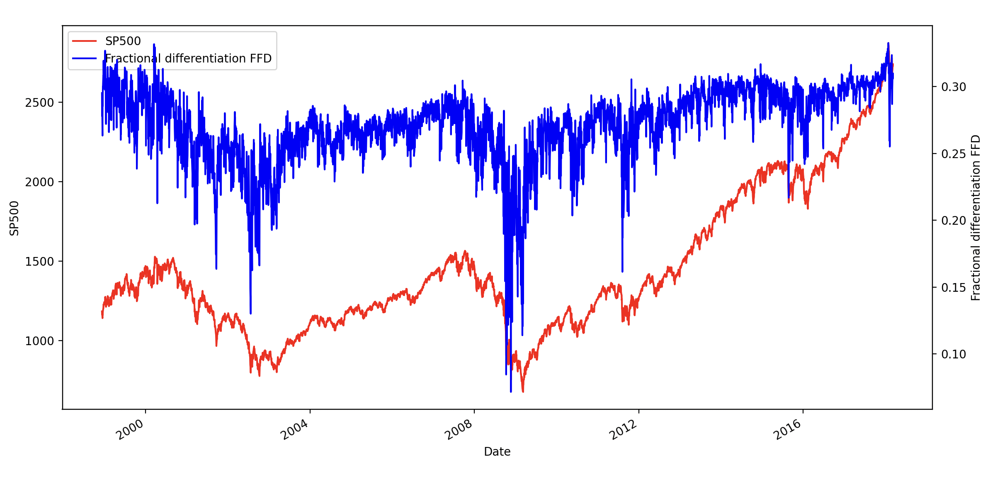

## Fractional Differentiation on Time Series (original implementation)

*As described in Advances of Machine Learning by Marcos Prado.*

### SP500 returns with fractional differentiation

This example reproduces the visual seen in the book of Marcos Prado.

<p align="center">
  
</p>

### Installation

Via PyPI.

```commandline
pip install fracdiff2
```

### API

As straightforward as possible.

```python
from fracdiff2 import frac_diff_ffd
import numpy as np

x = np.random.uniform(size=(1000,))
frac_diff_ffd(x, d=0.5)
```

### References

- https://www.wiley.com/en-us/Advances+in+Financial+Machine+Learning-p-9781119482086
- https://wwwf.imperial.ac.uk/~ejm/M3S8/Problems/hosking81.pdf
- https://en.wikipedia.org/wiki/Fractional_calculus

### Note

This repository was written in 2018. It seems like a new faster library was created in
2022: [fracdiff](https://github.com/fracdiff/fracdiff). It is worth checking it out.